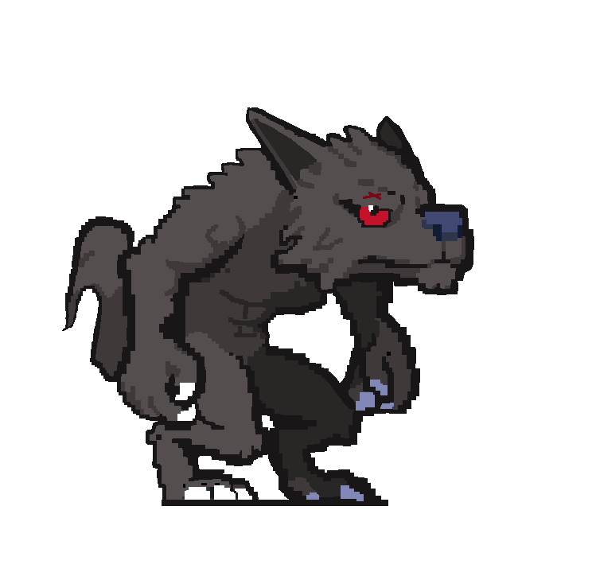
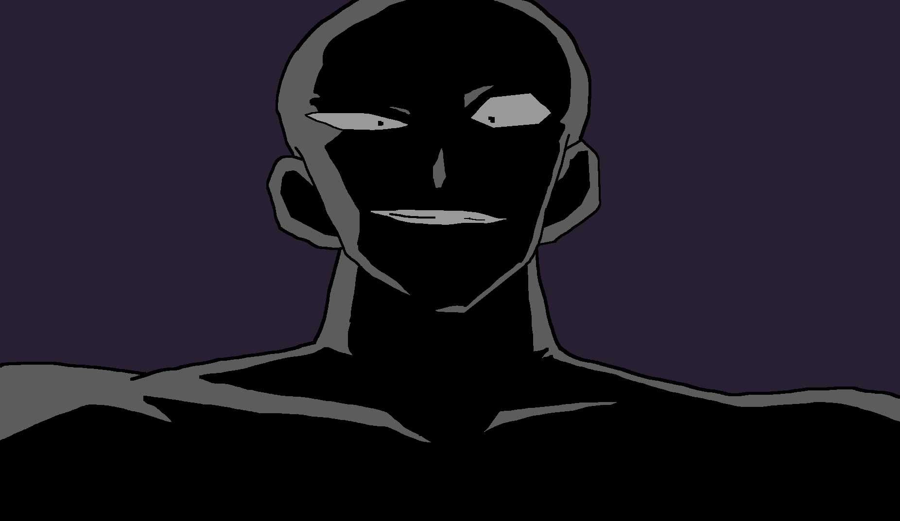
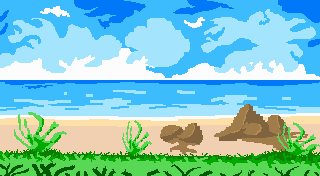

# Pixel Art Showcase

## 🎨 Overview
Welcome to my **Pixel Art Showcase**! This repository is dedicated to sharing my pixel art creations, ranging from character sprites to landscapes and game assets.

## ✨ Features
- **Original Pixel Art**: Handcrafted pixel pieces created from scratch.
- **Game Assets**: Icons, tilesets, and character sprites ready for use in game development.
- **Timelapse & Process**: Some artworks include process breakdowns and GIF timelapses.

## 📁 Gallery

Browse the `/art` folder for a full collection of my work.

## 🚀 Usage
Feel free to use my pixel art for personal projects, but please give proper credit! For commercial use, contact me directly. (issues are opened)

## 📜 License
This artwork is licensed under the **Creative Commons Attribution-NonCommercial 4.0 International (CC BY-NC 4.0)** license. See the [LICENSE](LICENSE) file for more details.
